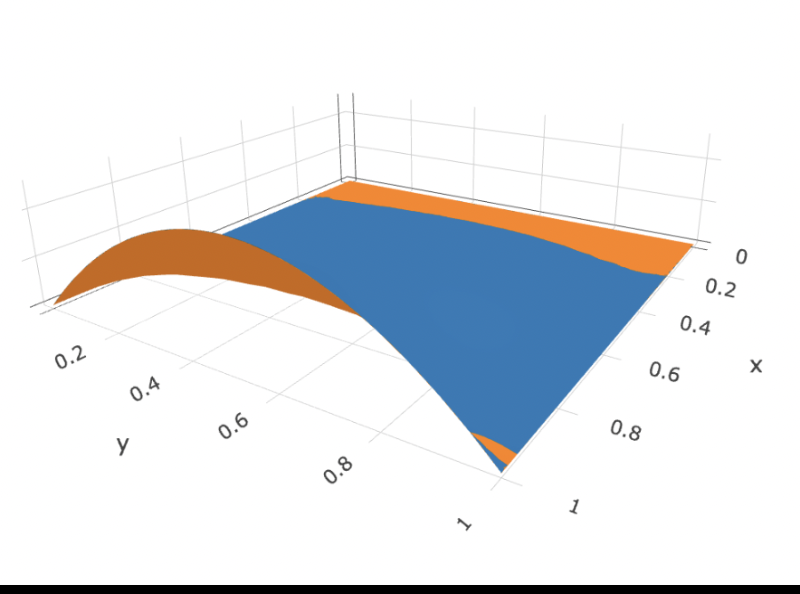

# README

## このリポジトリについて

JS による物理シミュレーションのポートフォリオです。
以下の目的があります

- 線形代数、微分方程式、最適化問題、反復法、その他の数値計算のためのアルゴリズムを０から実装できることを示します
  - [行列分解](https://github.com/sm921/cloth-simulation/blob/main/ts/helpers/math/matrix-decomposition.ts)
  - [行列変形](https://github.com/sm921/cloth-simulation/blob/main/ts/helpers/math/matrix-modification.ts)
  - [固有値、固有ベクトル](https://github.com/sm921/cloth-simulation/blob/main/ts/helpers/math/matrix-eigen.ts)
  - [Ax = b の様々な解法](https://github.com/sm921/cloth-simulation/blob/main/ts/helpers/math/solver.ts)
  - [最小化, ニュートン法、線探索、勾配降下法](https://github.com/sm921/cloth-simulation/blob/main/ts/helpers/algorithm/descent-method.ts)
  - マルチグリッド (「3 マルチグリッド」を参照)
- 論文を読解して、実装レベルに落とし込むことができることを示します
- 実際にブラウザで動作するデモへのリンクを記載します
  - [Spring](https://sm921.github.io/spring)
  - [Cloth](https://sm921.github.io/cloth)
  - [Multigrid](https://sm921.github.io/multigrid)
  - [Free fall](https://sm921.github.io/free-fall)

## 1 バネのシミュレーション

[ブラウザでリアルタイムでアニメーションを見ることができます](https://sm921.github.io/spring)

x(t_next) = argmin(x(t_now)のエネルギーの総和) で各フレームにおける、バネの端点の場所を計算して、画面に描画しています。
具体的には、 argmin は、　弾性エネルギーと運動エネルギーと重力の位置エネルギーの総和のヘッシアンが正定になるように変換して、その逆行列に、エネルギーの勾配をかけた値です。

ソースは、ts/spring/spring-simulator.ts にあります。

バネを複数連結して、バネの張力を大きくすることで、ひもをシミュレーションすることができます
GPU.js などの GPU を使った並列処理と、後述のマルチグリッドを用いることで、リアルタイムでブラシや毛などのリアルな動きを、ブラウザ上でリアルタイムで描画することができます。

## 2 布のシミュレーション

[ブラウザでリアルタイムでアニメーションを見ることができます](https://sm921.github.io/cloth)

ひもが複数のバネで表されるように、布も複数のバネで表されます。
x(t_next) = argmin(x(t_now)のエネルギーの総和) で各フレームにおける、布の格子点の場所を計算して、画面に描画しています。
具体的には、 argmin は、　弾性エネルギーと運動エネルギーと重力の位置エネルギーの総和のヘッシアンが正定になるように変換して、その逆行列に、エネルギーの勾配をかけた値です。

ソースは、ts/cloth/cloth-simulator.ts にあります。

ニュートン法による implicit な実装、Projective Dynamics による高速な実装の２通りを試しています。
[弾性体のシミュレーションの state-of-the-art](https://tiantianliu.cn/papers/xian2019multigrid/xian2019multigrid.html) は、この２つをベースに、マルチグリッドと GPGPU で処理を高速化したものです。

## 3 マルチグリッド

シミュレーションでは、Ax = b という式を解くことになります
処理にかかる時間は O(n^3)です。
マルチグリッドは、O(n)で解けるようにするためのアルゴリズムです。

微分方程式をマルチグリッドで解いています。
オレンジがマルチグリッドの解、ブルーが本当の答えです。
ほとんど一致しています。

### ∇・∇φ(x,y) = 1/2 x^2 - 1/6 x^4

### ∇・∇φ(x,y) = 6xy(1 - y) - 2x^3;

ソースは、ts/multigrid/mg.ts にあります。

[ブラウザで 3d グラフを動かすことができます](https://sm921.github.io/multigrid)
